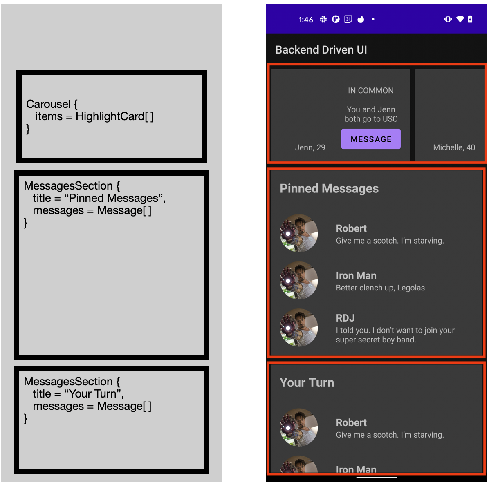

# BackendDrivenUI

An example of how some screens could be driven by the backend at Tinder. See [this proposal](https://docs.google.com/document/d/18u75-lQ33dD6ln-tJPl0LYwqjlot2mEKPB7XTBe8l2E/edit)

The example uses Android Architecture components, MVVM and [Epoxy](https://github.com/airbnb/epoxy). I used Epoxy to make my life easier, but of course you'd be free to use whatever you want (I'm looking at you [Jetpack Compose](https://developer.android.com/jetpack/compose)). See the [ViewModel](https://github.com/tinder-christopherperry/BackendDrivenUI/blob/main/app/src/main/java/com/tinder/backendui/ui/main/MainViewModel.kt) for an example of a response (hardcoded) from the server.

The basic idea is to break up UI into components that match horizontal slices of the client UI. Developers are freed up to develop UI components, never having to touch the page. This lets multiple teams add/remove/change things on the same page in tandem and not have to step on each other.



Here's what the API parsed to Kotlin looks like in this example

```kotlin
data class Component(
    val id: String,
    val type: String,
    val content: Content
)

sealed class Content {
    data class CarouselContent(val items: List<Component>) : Content()

    data class TextRowContent(val text: String) : Content()

    data class ButtonRowContent(val text: String) : Content()

    data class HighlightCardContent(
        val leftText: String,
        val topRightText: String,
        val midRightText: String,
        val buttonText: String
    ) : Content()

    data class MessagesSectionContent(
        val sectionTitle: String,
        val messages: List<Message>
    ) : Content()
}

data class Message(val title: String, val subtitle: String)
```

I did not implement a `TextRow` or a `ButtonRow` in this example but it's easily added to put text or a button anywhere on the page.

## Project Structure

This project contains 4 Gradle modules: app, plugins, messages, and highlights.

### plugin module

The plugin module provides the framework for the plugin architecture. It contains the class `Component`, and the interface `ComponentProvider`. `ComponentProvider` is a means for feature modules to plug into the app by simply declaring a Dagger binding for implementations, which the app obtains generically in a multi-bound (Dagger) map (see PluginsModule.kt for details). Feature module plugins are therefore declarative in nature, bound at compile via Dagger.

The Component data format translates to either rows in a RecyclerView or items in a Carousel (which is also a row in a RecyclerView).

### messages and hightlights modules

Examples of feature modules that provide implementations of ui Component implementations. In both of these modules implementations of `ComponentProvider` are declared in a Dagger module. See: HighlightsModule and MessagesModule for details. Note that `View` and `ComponentProvider` implementations in these modules are marked as `internal` and cannot be referenced in the app module!

### app module

Includes dependencies on the plugin, messages, and highlights module but contains no references to implementation details of the feature module. Compilation glues everything together via Dagger and the `MainFragment` injects a `Map<String, ComponentProvider>` where the String key refers to the Component type. Data is received in the usual manner via a `ViewModel` and the UI is populated according to the backend driven UI data model consisting of Components. The `Map<String, ComponentProvider>` is consulted to grab `ComponentProvider` in order to provide the UI with `EpoxyModel`s.
